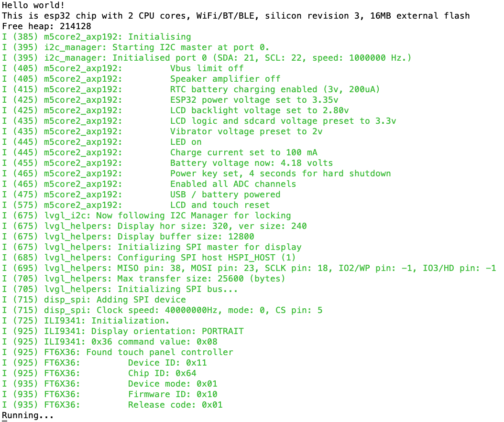

# M5Core2 with LVGL and I2C Manager


> **Repository Status**

> I found a repository named `m5core2-basic-idf` by Brian Starkey (@usedbytes) [here](https://github.com/usedbytes/m5core2-basic-idf). It did the same thing this repository does, but in a quick-hack demonstration kind of way. I want to program the M5Core2 device for real, so I took it upon myself to take over where he left it and make things as comfortable and clean as I could make them.

> The original version uses differently modified `lvgl_esp_drivers` and `axp192` components and was using Mika Tuupola's [I2C Helper](https://github.com/tuupola/esp_i2c_helper) but with the older version of Mika's I2C HAL API. I wrote my own [I2C Manager](https://github.com/ropg/i2c_manager) which is compatible but thread-safe (and integrated it into `lvgl_esp_drivers`).

&nbsp;

The original repository is intended as a straightforward example or base project for
using the M5Stack Core2 with ESP-IDF directly in C - i.e. No Arduino. This adds a number of components to make programming the M5Core2 easy using ESP-IDF. This now serves as much as a demo for how to get things working on an M5Stack Core2 device a it is a demo for the capabilities of the I2C Manager component that I wrote and the modifications to the lvgl\_esp\_drivers component.

Enjoy!

&nbsp;

## Functionality

This will present three slider toggles on the screen. They allow you to turn on or off the LED, the vibrator motor and the power to the external 5V bus. It thus demonstrates the use of the LVGL graphics library as well as initialization and control over the AXP192 power management chip


In the monitor output, we can see everything being initialised:



&nbsp;

## Building

This project builds without any further configuration using ESP-IDF and was tested with ESP-IDF versions 4.1, 4.2 and 4.3. There is no reason it shouldn't build with 3.x, but I haven't tested that. (Please file an issue to let me know.)


```
# Clone the repository, and its submodules
git clone https://github.com/ropg/m5core2_esp-idf_demo.git
cd m5core2_esp-idf_demo
git submodule update --init --recursive

# Build it, flash it, and see the serial output
idf.py build flash monitor
```

If at any time you want to start over (also removing any settings you may have changed in menuconfig) simply do:

```
idf.py fullclean
rm sdkconfig
idf.py build flash monitor
```


&nbsp;

## External Dependencies

All the components in this project are submodules that have their own github repository. Most are hosted by me because I wrote them or because the code depends on modifications I made to other people's code. Where I did the latter, the changes are made as 'cleanly' as I am able, and I hope the maintainers of the upstream repositories will adopt these changes.

&nbsp;

### ▶ [`components/i2c_manager`](https://github.com/ropg/i2c_manager)

The I2C manager provides thread-safe I2C for any component that needs it. It can be used directly as a dependency, built-in into another component as well as via a Mika Tuupola-compatible HAL API.

[More information](https://github.com/ropg/i2c_manager)

&nbsp;

### ▶ [`components/axp192`](https://github.com/tuupola/axp192)

Driver for the AXP192 Power Management IC.

This component does the low-level interfacing with the AXP192 Power management IC, courtesy of Mika Tuupola (@tuupola). The interaction between this component and m5core2\_axp192 shows how to use the Tuupola-style HAL feature of I2C Manager.

&nbsp;

### ▶ [`components/m5core2_axp192`](https://github.com/ropg/m5core2_axp192)

I wrote [this component](https://github.com/ropg/m5core2_axp192) to offer the initialisation routine and some service functions for the things attached to the axp192 Power Management IC in the M5Core2. It depends on the `axp19` and `i2c_manager` components above. This allows you to turn the LED, the vibrator, the audio amplifier and the external power on and off. See the [README](https://github.com/ropg/m5core2_axp192) for more details. More functionality might be added later.

> Some of the functionality was lifted from @usedbytes - Brian Starkey's [modification](https://github.com/usedbytes/axp192) of this component, but his mods were for a different version of Mika Tuupola's API, so instead of maintaining two modified versions of other people's components, I stuck what I needed in my component instead.

&nbsp;

### ▶ [`components/lvgl`](https://github.com/lvgl/lvgl)

[Light and Versatile Graphics Library](https://lvgl.io/)

This is not modified and taken from [their own repository](https://github.com/lvgl/lvgl). We're using release version 7, the master branch on their repository has moved to version 8.

&nbsp;

### ▶ [`components/lvgl_esp32_drivers`](https://github.com/ropg/lvgl_esp32_drivers)

I did a lot of work modifying this one:

* I redid a modification by Brian Starkey (@usedbytes) that adds an option to menuconfig (`LV_DISP_USE_RST`) to not allocate a GPIO for display reset, implementing it across all display drivers. This helps people who have the reset line tied or have it hooked up to an external Power Management IC.

* I added support for the M5Core2 display.

* I reworked the I2C code (that had clearly evolved over time and wasn't all that tidy) to now be routed through a built-in copy of my I2C Manager. This makes things cleaner and it gives us the ability to synchronise thread-safe mutex-locking between it and the other components using the I2C Manager component. That is what enabled the line

	```c
	lvgl_i2c_locking(i2c_manager_locking());
	```

	in `main.c` to cause the line

	```
	lvgl_i2c: Now following I2C Manager for locking.
	```

	to appear in the monitor output. You can read about how I2C now works inside the LVGL drivers [here](https://github.com/ropg/lvgl_esp32_drivers/blob/I2C_Manager/i2c_manager/README.md) and see the different ways that I2C Manager can work with other components [here](https://github.com/ropg/i2c_manager).


&nbsp;

## Known Issues

### Apparent high CPU usage

The LVGL CPU-usage icon shows ~50% CPU utilisation most of the time. However
during development, I have seen this sometimes show ~0% most of the time. I'm
not sure if there's some strangeness around how FreeRTOS is scheduling the LVGL
work which means it really is using 50% CPU, or if it's just a quirk of how
LVGL is measuring utilisation.

Needs more investigation.
